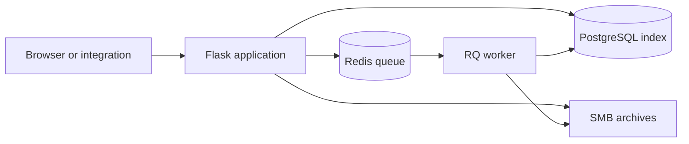

# Archives Application

An internal application for UCSC Physical Planning, Development & Operations (PPDO), built around its archives file server and campus project-record workflows. It connects the department's Windows/SMB document archive with a searchable PostgreSQL index, project and contract metadata, and tools for the archivists who maintain those records.

The system reflects this particular archive's folder structure, filing conventions, Windows paths, and related data services. This README introduces the system and the engineering behind it. Technical details live in [reference/](reference/README.md); end-user instructions are maintained in a separate guide.

| Web application | Data and search | Background work | File storage |
| --- | --- | --- | --- |
| Python 3.13+ · Flask | PostgreSQL · full-text search | Redis · RQ | Windows/SMB archives |

## Context

The archive brings together construction documents, project records, and building information accumulated across campus projects. A filesystem path alone does not capture all that context: documents can have multiple copies, project identifiers can be ambiguous, and useful information may be inside the document text.

The application connects those records while preserving the existing file-server organization. A [September 2026 design snapshot](reference/project_search_feature_spec.md#database-context) describes roughly **760,000 canonical files** and **one million indexed file locations**, which makes duplicate handling, bounded queries, and index maintenance central to the design.

## Capabilities

| Area | What the system provides |
| --- | --- |
| Document discovery | Filename, path, and extracted-text search; project, CAAN, and location scopes; duplicate grouping; coverage information; Excel exports. |
| Project context | Project and contract metadata search, linked CAAN/building records, archive locations, and contract cost and schedule views. |
| Archival work | Uploads, individual and batch inbox processing, duplicate checks, and filing into the established project-directory structure. |
| File-server management | Controlled move, rename, delete, create, and consolidation workflows, with quantity limits and queued database reconciliation. |
| Internal operations | Archivist timekeeping and activity summaries, index maintenance, backups, cleanup, diagnostics, and integration APIs. |

## Architecture

Flask serves the web interface and HTTP APIs through five blueprints: `archiver`, `project_tools`, `users`, `timekeeper`, and `main`. SQLAlchemy models represent files and their locations, projects, CAANs, contracts, accounts, and task history. Redis/RQ carries indexing, reconciliation, and maintenance work to a separate worker.

Archive search runs in the web process against PostgreSQL. The associated ingestion and synchronization services supply extracted text, search chunks, detected dates, and project/contract business data. Database migrations are maintained in `business_services_db`; this application maintains archive file and project-location records and presents the shared data.

## Engineering decisions

- **File identity is separate from location.** A content hash identifies a canonical file, while location rows record its copies. Search groups results by hash and preserves access to each indexed path.
- **Stored paths are independent of mount points.** Database paths are relative to the archive root. Shared conversion helpers map them to the application's mounted filesystem or the Windows paths used by staff, preserving meaningful spaces and directory boundaries.
- **File edits have a reconciliation lifecycle.** `ServerEdit` centralizes filesystem changes and affected-quantity checks. RQ tasks reconcile the database afterward, with task IDs, status, and results recorded in `WorkerTaskModel`.
- **Content search accounts for incomplete extraction.** PostgreSQL full-text search operates on document chunks, with scope and candidate limits. Results expose extraction coverage so missing text is not mistaken for a missing document. The schema also contains pgvector embeddings, while the implemented archive search uses keyword retrieval.
- **Metadata lookup keeps identifiers explicit.** Project links retain canonical database IDs. Read-only APIs validate selectors and report ambiguous project numbers or file paths instead of choosing an arbitrary record.

## Code map

| Location | Responsibility |
| --- | --- |
| [archives_application/__init__.py](archives_application/__init__.py) | Application factory, extensions, blueprint registration, and queue connection. |
| [archiver/](archives_application/archiver/) | Archival workflows, search, file information, server edits, and reconciliation tasks. |
| [project_tools/](archives_application/project_tools/) | Project/CAAN search and detail views, metadata APIs, and project-location maintenance. |
| [models.py](archives_application/models.py) and [utils.py](archives_application/utils.py) | Shared data models, path conversion, authorization, file utilities, and queue helpers. |
| [users/](archives_application/users/), [timekeeper/](archives_application/timekeeper/), and [main/](archives_application/main/) | Authentication, timekeeping, configuration, diagnostics, and maintenance. |
| [templates/](archives_application/templates/) and [static/](archives_application/static/) | Server-rendered interface, styles, and generated assets. |
| [run.py](run.py) and [worker.py](worker.py) | Web application and RQ worker entry points. |
| [tests/](tests/) | Regression coverage for project search/exports, shareable search URLs, and missing-path handling. |

## Documentation

- [Reference index](reference/README.md) — configuration, APIs, operations, development, specifications, and historical investigations.
- [Development journal](reference/development_journal.md) — implemented changes and their operational context.
- [Repository guidelines](AGENTS.md) — conventions for maintaining the application.

The regression suite exercises selected application behavior with SQLite fixtures, temporary files, and mocked services. PostgreSQL content search, live SMB operations, OAuth, and worker integration also require verification against the existing system's development environment; the [development reference](reference/development.md) describes that boundary.
